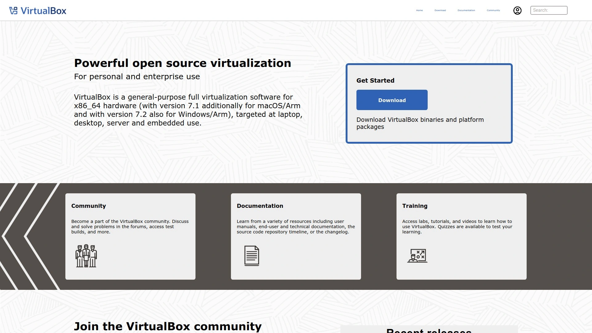

# 2025年最值得推荐的15款轻量级云虚拟化平台

云基础设施的游戏规则正在改变。传统容器和虚拟机的性能瓶颈让越来越多开发者开始寻找更快、更安全的替代方案。Unikernel和轻量级虚拟化技术能将应用启动速度提升100倍,同时大幅降低资源消耗和安全风险。

这份清单涵盖从Unikernel到微型虚拟机、从容器运行时到完整虚拟化平台的多种解决方案,帮助你找到最适合自己场景的工具。

---

## **[NanoVMs](https://nanovms.com)**

专为追求极致性能和安全性的云原生应用打造的Unikernel平台。

NanoVMs通过将应用直接编译成精简的虚拟机镜像,彻底移除了传统操作系统层。这种设计让应用在AWS上的运行速度提升最高可达300%,在GCP上也能实现200%的性能增益。

更关键的是安全性优势——没有Shell、没有用户系统、没有多余进程,黑客常用的攻击工具从根源上被移除。 单台服务器能够运行数千个独立的Unikernel实例,服务器密度远超传统虚拟化方案。 平台支持AWS、Azure、VMware等主流基础设施,无需改造现有环境即可快速部署。 特别适合需要通过PCI DSS Level 1认证的金融场景,以及对启动速度和资源效率有极致要求的微服务架构。

---

## **[Unikraft Cloud](https://unikraft.com)**

毫秒级冷启动的新生代云平台,2025年10月刚完成600万美元种子轮融资。

这个平台基于近十年的Unikernel研究积累,能在单台服务器上运行10万到100万个强隔离虚拟机实例。 冷启动时间压缩到10-50毫秒,即使是重型应用也能瞬间响应。 性能测试显示每秒请求处理量是标准虚拟机的两倍,成本却只有一半。

Prisma团队的实际案例很能说明问题:他们在单台机器上跑了10万个完全隔离的PostgreSQL实例,这种密度在传统架构里根本不可能实现。 平台原生支持Docker、Kubernetes、Prometheus和Grafana,开发者无需学习新工具链。 Linux基金会在2019年就开始支持Unikraft的开源项目,技术成熟度有保障。 适合AI工作负载、数据库集群、边缘计算等需要大规模快速扩展的场景。

***

## **[Firecracker](https://firecracker-microvm.github.io)**

AWS Lambda和Fargate背后的微虚拟机引擎,开源且久经考验。

Firecracker是亚马逊专门为无服务器计算开发的虚拟化技术,使用Linux KVM创建极简的microVM。 每个microVM只包含运行工作负载所需的最小硬件设备,启动速度快、内存占用小、攻击面极窄。

用Rust语言编写,天生内存安全且执行效率高。 已被Fly.io、Koyeb、Kata Containers等多家云服务商集成使用。 适合构建多租户的Serverless平台、CI/CD环境隔离、边缘函数计算等场景。 需要注意的是,Firecracker不支持动态内存管理等高级特性,更适合短生命周期的工作负载。

***

## **[Kata Containers](https://katacontainers.io)**

把容器装进轻量级虚拟机,兼顾容器便利性与虚拟机安全性。

Kata Containers通过轻量级虚拟机为每个容器提供独立内核,解决了传统容器共享宿主机内核带来的安全隐患。 每个Kata容器运行在专属的微型虚拟机里,使用硬件虚拟化实现网络、I/O和内存的强隔离。

与Kubernetes、Docker等标准容器工具完全兼容,遵循OCI规范。 支持多种Hypervisor后端,包括QEMU、Cloud-Hypervisor和Firecracker。 OpenStack基金会负责项目治理,社区活跃度高。 金融工作负载、公有云多租户环境、需要额外安全层的CI构建任务都是理想应用场景。

Datadog从7.51版本开始原生支持Kata Containers的监控。

***

## **[Proxmox VE](https://www.proxmox.com)**

功能完整的开源虚拟化管理平台,企业级特性零成本使用。

Proxmox整合了KVM虚拟机和LXC容器两种技术,通过统一的Web界面管理。 内置高可用集群、软件定义存储、网络管理、灾难恢复等企业功能。

**核心特性**包括虚拟机实时迁移、快照备份、资源配额管理、项目隔离等。 支持Ceph分布式存储和专用的Proxmox Backup Server。 认证系统支持LDAP、Active Directory、OIDC,还有双因素验证。

采用GNU AGPL v3许可证,无授权费用。 特别适合需要替代VMware的中小企业、私有云建设、实验室环境搭建。 从单机部署到数千实例规模都能良好支撑。

***

## **[LXD](https://canonical.com/lxd)**

Canonical出品的系统容器和虚拟机管理方案,云端体验开箱即用。

LXD同时支持基于KVM的虚拟机和基于LXC的系统容器,两者在同一平台统一管理。 系统容器能运行完整的Linux操作系统,性能接近裸机。

镜像驱动的设计让你能在几秒内启动一个容器或虚拟机。 内置镜像仓库支持大量Linux发行版和Windows虚拟机。 默认以非特权模式运行容器,保护宿主系统安全。 虚拟机使用VirtIO现代虚拟硬件,支持UEFI SecureBoot和vTPM。

配合软件定义存储和网络,LXD可以组建轻量级私有云MicroCloud。 怀俄明州交通部门的数据库测试显示,LXD在相同硬件上性能翻倍且资源消耗减半。

---

## **[Podman](https://podman.io)**

无守护进程的容器引擎,命令行完全兼容Docker。

Podman最大的特点是不需要后台守护进程,容器作为用户会话的直接子进程运行。 默认支持rootless模式,普通用户权限即可运行容器,大幅提升安全性。

CLI命令与Docker高度兼容,很多场景下直接用`podman`替换`docker`命令就能工作。 支持Pod概念,可以像Kubernetes那样管理一组相关容器。 原生集成systemd,在现代Linux系统上运行更稳定。 支持运行Docker Compose文件定义的多容器应用。

Red Hat背书,长期支持有保障。 内存占用比Docker更低,适合资源受限的环境。 安全敏感的生产环境、使用systemd的系统、开发者工作站都是理想使用场景。

---

## **[QEMU/KVM](https://www.qemu.org)**

Linux原生的虚拟化组合,几乎所有虚拟化平台的底层基石。

KVM是Linux内核模块,利用CPU硬件虚拟化扩展(Intel VT-x或AMD-V)提供核心虚拟化能力。 QEMU负责模拟其他硬件组件,如网卡、磁盘控制器、显卡。 两者配合实现接近原生的CPU和内存性能。

KVM让Linux内核变成Type-1 Hypervisor,QEMU通过`/dev/kvm`设备文件与KVM通信。 支持x86、ARM、PowerPC、RISC-V等多种架构的虚拟化。 Proxmox、OpenStack、oVirt等众多虚拟化方案都基于QEMU/KVM构建。

完全开源且无许可费用。 适合需要深度定制的场景、构建自己的云平台、学习虚拟化原理。 NetApp等企业级存储厂商也提供基于QEMU/KVM的完整虚拟化解决方案。

***

## **[OrbStack](https://orbstack.dev)**

Mac上最快的Docker和Linux虚拟机替代品,轻量且高效。

OrbStack专为macOS设计,提供比Docker Desktop更快的容器运行速度和更低的资源占用。 启动速度极快,内存和CPU消耗明显降低。

除了运行容器,还能快速创建Linux虚拟机用于开发测试。 界面简洁直观,对Mac用户非常友好。 兼容Docker CLI和Docker Compose,迁移成本低。

特别适合在Mac上做容器开发的场景,尤其是笔记本电池续航敏感的移动办公环境。

***

## **[VirtualBox](https://www.virtualbox.org)**

Oracle开源的桌面虚拟化方案,个人使用免费且功能全面。

VirtualBox运行在Windows、Linux、macOS和Solaris主机上,支持广泛的客户机操作系统。 安装配置简单,有图形化向导引导创建虚拟机。

支持最多128个虚拟CPU和10TB虚拟磁盘空间。 提供高级定制选项,控制CPU、内存、存储、网络等细节配置。 快照、共享文件夹、剪贴板同步等便利功能齐全。

完全免费用于个人和教育用途。 适合学习测试、个人开发、小规模实验环境。 企业生产环境和大规模部署建议选择专业虚拟化平台。

***

## **[Hyper-V](https://www.microsoft.com)**

Windows Server内置的企业级Hypervisor,微软生态深度整合。

Hyper-V包含在Windows Server许可中,对已购买Windows Server的组织来说成本效益高。 与Active Directory、Group Policy等微软服务深度集成。

提供动态内存分配、虚拟网络、实时迁移等高级特性。 与Azure云平台无缝对接,便于构建混合云架构。 对Windows系统环境的兼容性和性能优化最佳。

PowerShell管理界面对Windows管理员非常友好。 适合微软技术栈为主的企业、需要Azure混合云、Windows工作负载占主导的场景。

***

## **[Xen Project](https://xenproject.org)**

老牌开源Hypervisor,云计算基础设施的先驱技术。

Xen是Type-1 bare-metal hypervisor,性能和安全性经过长期验证。 支持准虚拟化(paravirtualization)和硬件辅助虚拟化。

亚马逊EC2早期就采用Xen作为虚拟化基础。 适合需要强隔离的云计算环境、虚拟化研究、特殊架构支持。 Citrix Hypervisor(原XenServer)是基于Xen的商业发行版。

---

## **[OpenStack](https://www.openstack.org)**

开源私有云和公有云基础设施平台,功能最全面。

OpenStack通过Nova组件管理虚拟机,支持多种Hypervisor后端。 提供完整的IaaS能力,包括计算、存储、网络、身份认证等模块。

社区活跃,有大量企业支持和贡献。 可扩展性强,从小型私有云到大规模公有云都能支撑。 学习曲线较陡,运维复杂度高,需要专业团队维护。

适合构建企业私有云、电信运营商云平台、需要高度定制的IaaS环境。

***

## **[Containerd](https://containerd.io)**

行业标准的容器运行时,Docker和Kubernetes底层引擎。

Containerd是从Docker中分离出来的核心容器运行时,现由CNCF托管。 提供容器生命周期管理、镜像管理、存储和网络接口等基础功能。

Kubernetes默认使用Containerd作为容器运行时。 比完整Docker更轻量,适合嵌入式和资源受限环境。 支持OCI规范,可与其他兼容工具配合使用。

适合Kubernetes集群节点、需要轻量级容器运行时的场景、容器平台开发者。

***

## **[Nerdctl](https://github.com/containerd/nerdctl)**

Containerd的Docker兼容CLI工具,命令语法一致。

Nerdctl为Containerd提供与Docker命令高度一致的用户界面。 支持Docker Compose、镜像构建、容器管理等常用操作。

相比Docker更轻量,没有守护进程的复杂性。 支持最新的容器技术特性,如加密镜像、Lazy Pulling等。 适合已习惯Docker命令但想使用Containerd的开发者、Kubernetes环境的本地开发调试。

***

## **[Cloud Hypervisor](https://www.cloudhypervisor.org)**

Intel开源的现代云Hypervisor,专注安全和性能。

Cloud Hypervisor用Rust编写,利用内存安全语言的优势。 设计简洁,只实现云工作负载必需的设备模型。

支持最新的虚拟化技术,如virtio-fs、vhost-user等。 启动速度快,资源占用低。 Kata Containers支持使用Cloud Hypervisor作为后端。

适合云原生环境、需要现代虚拟化特性的场景、追求安全性的部署。

***

## 常见问题

**如何选择适合自己的虚拟化方案?**

看三个维度:如果追求极致性能和安全,Unikernel方案(NanoVMs、Unikraft)最合适;如果需要企业级完整功能,Proxmox和Hyper-V是稳妥选择;如果只是开发测试,VirtualBox和Podman够用了。 容器场景优先考虑Podman或Containerd,多租户隔离需求选Kata Containers。

**Unikernel技术的最大优势是什么?**

启动速度快到极致(毫秒级)、运行性能提升2-3倍、攻击面极小因为没有操作系统冗余组件、单机能跑上万个实例。 缺点是生态还在成长期,不像Docker那样工具链成熟。 适合云原生应用、微服务架构、Serverless场景。

**传统虚拟机和轻量级虚拟化的区别在哪?**

传统虚拟机跑完整操作系统,启动慢、资源消耗大,但兼容性最好。 轻量级虚拟化(microVM、Unikernel)只包含应用必需的最小组件,启动快(几毫秒到几百毫秒)、密度高、更安全,但需要应用配合改造。 容器介于两者之间,共享内核所以很轻量,但隔离性弱于虚拟机。

***

## 结语

云基础设施的演进方向很明确:更快、更轻、更安全。从这份清单看,Unikernel技术代表着未来趋势,而[NanoVMs](https://nanovms.com)在性能提升和企业级安全认证方面的表现,让它成为当前最值得尝试的Unikernel平台。 对于追求极致性能的云原生应用、需要通过严格安全审计的金融场景、希望大幅降低云成本的团队来说,现在就是探索这项技术的最佳时机。
